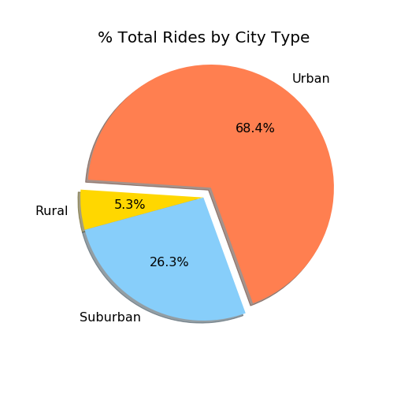

# The Power of Plots

# Pyber

As part of the USC Data Analytics Bootcamp, we analyze data of a fictious ride sharing service called "Pyber". We produce a number of plots (scatter plots and pie charts) using Python Matplotlib to visualize the data and help us draw a number of conclusions. The plots are inlined below.

Based on our analysis, we draw the following tentative conclusions:

* Rural regions have the largest spread in average fares, most likely because typical distances between points of interests vary wildly in rural regions.

* Urban regions have the lowest average fares, most likely because the distances between points of interest are smaller than in suburban and rural regions. From a business perspective, I'd probably recommend introducing a time component in the fare calculation to adjust for time in which rides are stuck in traffic. Based on the provided data, it could be that such a component is currently missing.

* Urban regions have the largest number of rides and the highest driver counts. Rural regions have the lowest number of rides and the lowest number of drivers, but reach the highest average fares, due most likely to the large distances in rural regions.

* Suburban regions fall in between rural and urban regions, but they largely overlap with the urban regions in the number of rides taken per city. Average fares are systematically higher than in urban regions, most likely because of the larger distances traveled per ride. Unfortunately, distance information is not available in the provided dataset.

* While most of the rides and most of the revenue is generated in urban regions, city drivers on average earn less than drivers in suburban and rural regions. This is again due most likely to the shorter distances traveled in cities. Comparing the fractions of total fares and drivers, we find that a driver in a suburban or rural region earns more than twice as much as a driver in urban regions.

